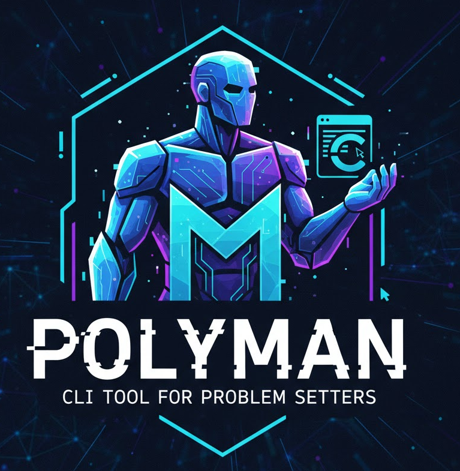

<div align="center">



# Polyman

A command-line interface tool for Codeforces problem setters to create, test, and verify competitive programming problems without leaving the terminal.

[](https://www.npmjs.com/package/polyman-cli)
[](https://opensource.org/licenses/MIT)
[](https://www.typescriptlang.org/)
[](https://nodejs.org/)
[](https://hamzahassanain.github.io/polyman/)
[](http://makeapullrequest.com)

---

### Table of Contents

[Overview](#overview) • [Key Features](#key-features) • [Installation](#installation) • [Getting Started](#getting-started) • [Commands](#command-reference) • [Remote Operations](#remote-operations) • [Solution Types](#solution-types) • [Standard Checkers](#standard-checkers) • [Example](#complete-example-integer-square-problem) • [Project Structure](#project-structure) • [Workflow](#typical-workflow) • [Advanced Features](#advanced-features) • [Documentation](#documentation-and-resources) • [Contributing](#support-and-contributions) • [License](#license)

---

</div>

## Overview

Polyman automates the workflow for creating competitive programming problems by providing tools to:

- Generate problem templates with predefined folder structures
- Create test cases using programmable generators
- Validate test inputs against problem constraints
- Execute multiple solution types (correct, wrong answer, time limit exceeded, etc.)
- Compare solution outputs using standard or custom checkers
- Verify entire problem packages in a single command

This tool eliminates the need to switch between different environments and manual testing processes, allowing problem setters to work entirely within their development environment.

## Key Features

### Problem Template Generation

Automatically creates a complete problem structure including directories for solutions, test generators, validators, and checkers. This provides a standardized starting point for all problems.

### Test Case Generation

Generates test cases programmatically using C++ generator programs. Generators can create randomized or structured test inputs based on test number and custom logic.

### Input Validation

Validates all test inputs against problem constraints using testlib.h validators. Ensures test cases meet specified ranges, formats, and structural requirements before solutions are tested.

### Output Verification

Compares solution outputs using either standard checkers (for common answer formats) or custom checkers (for problems requiring special comparison logic). Supports multiple verdict types.

### Multi-Solution Testing

Tests multiple solution types simultaneously:

- Main correct solution (reference answer)
- Additional correct solutions (alternative approaches)
- Wrong answer solutions (must fail on at least one test)
- Time limit exceeded solutions (must timeout on at least one test)
- Memory limit exceeded solutions
- Runtime error solutions

### Complete Verification Workflow

Executes the entire testing pipeline with a single command: generates tests, validates inputs, tests checkers, runs all solutions, and verifies verdicts match expected types.

### Multi-Language Support

Compiles and executes solutions written in C++ (g++), Python (python3), and Java (javac/java).

### Polygon Integration

Seamlessly integrates with Codeforces Polygon through a complete TypeScript SDK:

- **Pull Problems**: Download problems from Polygon to work locally
- **Push Changes**: Upload your local changes back to Polygon
- **View Problems**: Display detailed problem information from Polygon
- **Commit Changes**: Commit your modifications with descriptive messages
- **Build Packages**: Create and download problem packages
- **List Problems**: Browse all accessible problems on your Polygon account

Work on problems locally with your preferred tools, then sync with Polygon when ready.

## Installation

### System Requirements

- **Node.js** version 14 or higher
- **C++ Compiler** (g++ with C++17 or later support)
- **Python 3** (optional - required only for Python solutions)
- **Java JDK** (optional - required only for Java solutions)

### Installing via npm

Install globally to use the `polyman` command from anywhere:

```bash
npm install -g polyman-cli
```

### Installing from Source

Clone the repository and build locally:

```bash
git clone https://github.com/HamzaHassanain/polyman.git
cd polyman
npm install
npm run build
npm link
```

### Verifying Installation

Confirm the installation was successful:

```bash
polyman --version
```

This should display the installed version number.

## Getting Started

> 📚 **New to Polyman?**
>
> - **Quick Start**: Follow the steps below for a rapid introduction
> - **Step-by-Step Tutorial**: Check out our [beginner-friendly tutorial](TUTORIAL.md) for a complete walkthrough
> - **Complete Guide**: See the [comprehensive guide](GUIDE.md) for in-depth documentation on all features

### Working Locally (New Problem)

#### Step 1: Create a New Problem

Generate a new problem directory with template files:

```bash
polyman new my-problem
cd my-problem
```

### Working with Polygon (Existing Problem)

If you have an existing problem on Polygon, you can pull it to work locally:

```bash
# Register your API credentials (one-time setup)
polyman remote register

# Pull the problem
polyman remote pull 123456 ./my-problem
cd my-problem

# Work on it locally, then push changes back
polyman remote push .
polyman remote commit . -m "Updated solutions"
```

See [Remote Operations](#remote-operations) for complete documentation.

This command creates a complete problem structure containing:

- `Config.json` - Problem configuration file
- `solutions/` - Directory for solution files
- `generators/` - Directory for test generators
- `validator/` - Directory for input validator
- `checker/` - Directory for output checker
- `statements/` - Directory for problem statements

### Step 2: Configure the Problem

Edit the `Config.json` file to define your problem parameters:

```json
{
  "name": "my-problem",
  "description": "Problem description",
  "timeLimit": 2000,
  "memoryLimit": 256,
  "inputFile": "stdin",
  "outputFile": "stdout",
  "interactive": false,
  "tags": ["implementation"],
  "solutions": [
    {
      "name": "main",
      "source": "./solutions/Solution.cpp",
      "tag": "MA",
      "sourceType": "cpp.g++17"
    }
  ],
  "generators": [
    {
      "name": "gen-random",
      "source": "./generators/Generator.cpp"
    }
  ],
  "checker": {
    "name": "ncmp",
    "isStandard": true
  },
  "validator": {
    "name": "validator",
    "source": "./validator/Validator.cpp"
  },
  "testsets": [
    {
      "name": "tests",
      "generatorScript": {
        "commands": [
          {
            "type": "generator",
            "generator": "gen-random",
            "range": [1, 20],
            "group": "main"
          }
        ]
      },
      "groupsEnabled": true,
      "groups": [
        {
          "name": "main"
        }
      ]
    }
  ]
}
```

**Configuration Parameters:**

- `timeLimit`: Maximum execution time in milliseconds
- `memoryLimit`: Maximum memory usage in megabytes
- `inputFile`: Input source (stdin or file name)
- `outputFile`: Output destination (stdout or file name)
- `solutions`: Array of solution files with their tags and source types
- `generators`: Array of test generator programs
- `checker`: Output verification configuration (standard or custom)
- `validator`: Input validation program configuration
- `testsets`: Array of test set configurations with generation scripts

### Step 3: Generate Test Cases

Run the test generators defined in your configuration:

```bash
polyman generate --all
```

This executes all generators and creates test input files in the `tests/` directory. Each generator produces test files numbered according to its `tests-range` specification.

### Step 4: Run Complete Verification

Execute the full verification workflow:

```bash
polyman verify
```

This command performs the following operations in sequence:

1. Generates all test cases using configured generators
2. Tests the validator against its test suite (`validator_tests.json`)
3. Validates all generated test inputs
4. Tests the checker against its test suite (`checker_tests.json`)
5. Compiles and runs all solutions on all tests
6. Verifies that each solution produces the expected verdicts

The verification passes only if all steps complete successfully and all solution verdicts match their expected types.

## Command Reference

### Problem Management

**`polyman new <directory>`**
Creates a new problem template in the specified directory. The directory must not already exist.

**`polyman download-testlib`**
Downloads the testlib.h header file from the official repository. This file is required for writing validators, generators, and custom checkers.

### Checker Management

**`polyman list checkers`**
Displays all available standard checkers with descriptions. Standard checkers handle common output formats like integers, floating-point numbers, and token sequences.

**`polyman list testsets`**
Lists all available testsets defined in the configuration. Shows testset names, number of tests, and group information.

### Test Generation

**`polyman generate [options]`**
Generates test input files based on testset/group/test specification.

**Options:**

- `-a, --all` - Generate all testsets
- `-t, --testset <name>` - Generate specific testset
- `-g, --group <name>` - Generate specific group within testset
- `-i, --index <number>` - Generate specific test by index

Examples:

```bash
polyman generate --all                     # Generate all testsets
polyman generate --testset tests           # Generate 'tests' testset
polyman generate --testset tests --group samples  # Generate 'samples' group
polyman generate --testset tests --index 5        # Generate test #5
```

### Input Validation

**`polyman validate [options]`**
Validates test input files using the validator program. Returns VALID or INVALID verdict for each test.

**Options:**

- `-a, --all` - Validate all testsets
- `-t, --testset <name>` - Validate specific testset
- `-g, --group <name>` - Validate specific group within testset
- `-i, --index <number>` - Validate specific test by index

Examples:

```bash
polyman validate --all                     # Validate all testsets
polyman validate --testset tests           # Validate 'tests' testset
polyman validate --testset tests --group samples  # Validate 'samples' group
polyman validate --testset tests --index 5        # Validate test #5
```

### Solution Execution

**`polyman run <solution-name> [options]`**
Executes the specified solution on test files. Creates output files in `solutions-outputs/` directory.

**Options:**

- `-a, --all` - Run on all testsets
- `-t, --testset <name>` - Run on specific testset
- `-g, --group <name>` - Run on specific group within testset
- `-i, --index <number>` - Run on specific test by index

Examples:

```bash
polyman run main --all                     # Run main solution on all testsets
polyman run main --testset tests           # Run main solution on 'tests' testset
polyman run main --testset tests --group samples  # Run on 'samples' group
polyman run main --testset tests --index 5        # Run on test #5
```

### Testing and Verification

**`polyman test <what>`**
Tests a specific component against its test suite or against the main correct solution.

**Options:**

- `validator` - Test validator with validator_tests.json
- `checker` - Test checker with checker_tests.json
- `<solution-name>` - Test solution against main correct solution

Examples:

```bash
polyman test validator        # Test validator with validator_tests.json
polyman test checker          # Test checker with checker_tests.json
polyman test wa-solution      # Test wa-solution against main solution
```

**`polyman verify`**
Runs the complete verification workflow. This is the primary command for validating an entire problem package. Includes test generation, validation, checker testing, solution execution, and verification.

## Remote Operations

Polyman provides complete integration with Codeforces Polygon, allowing you to work on problems locally and sync with Polygon.

### Setup

**`polyman remote register`**
Register your Polygon API credentials (API key and secret). Credentials are securely stored in `~/.polyman/credentials.json`.

```bash
polyman remote register
# You'll be prompted for:
# - API Key
# - API Secret
```

**Getting API Credentials:**

1. Visit [https://polygon.codeforces.com/api/help](https://polygon.codeforces.com/api/help)
2. Generate an API key and secret
3. Use `polyman remote register` to save them

### Problem Management

**`polyman remote list [options]`**
List all problems accessible on your Polygon account.

**Options:**

- `--id-only` - Display only problem IDs (useful for scripts)
- `--owner <handle>` - Filter by owner handle

Examples:

```bash
polyman remote list                    # List all problems with details
polyman remote list --id-only          # List only problem IDs
polyman remote list --owner tourist    # List problems owned by tourist
```

**`polyman remote view <problemId>`**
Display detailed information about a specific problem on Polygon.

```bash
polyman remote view 123456
```

### Working with Problems

**`polyman remote pull <problemId> <directory> [options]`**
Download a problem from Polygon to work on locally. Creates complete problem structure with all components.

**Options:**

- `--skip-tests` - Don't download test files (useful for large test sets)
- `--skip-statements` - Don't download problem statements

**Downloads:**

- Solutions with tags (main, correct, wrong answer, etc.)
- Checker and checker tests
- Validator and validator tests
- Generators
- Statements in all languages
- Tests (generated and manual)
- Complete Config.json

Examples:

```bash
polyman remote pull 123456 ./my-problem           # Full download
polyman remote pull 123456 ./my-problem --skip-tests  # Skip tests
```

**`polyman remote push <directory> [options]`**
Upload your local changes back to Polygon. Updates all problem components on Polygon.

**Options:**

- `--skip-tests` - Don't upload test files
- `--skip-statements` - Don't upload problem statements
- `--skip-solutions` - Don't upload solution files
- `--skip-checker` - Don't upload checker
- `--skip-validator` - Don't upload validator
- `--skip-generators` - Don't upload generator files

**Uploads:**

- Problem limits and settings
- Solutions with correct tags
- Checker and validator
- Generators
- Statements
- Tests and test groups
- Generation scripts

Examples:

```bash
polyman remote push ./my-problem                  # Push everything
polyman remote push ./my-problem --skip-tests     # Push without tests
```

**Important:** After pushing, your changes are in the working copy. Use `commit` to save them to the repository.

**`polyman remote commit <directory> -m <message>`**
Commit your changes to the Polygon repository with a descriptive message.

```bash
polyman remote commit ./my-problem -m "Added new test cases"
polyman remote commit ./my-problem -m "Fixed validator bug"
```

### Package Building

**`polyman remote package <directory> [options]`**
Build a complete problem package on Polygon. The tool waits for the package to finish building (polls every 60 seconds, maximum 30 minutes).

**Options:**

- `--full` - Build full package (default: standard package)
- `--verify` - Verify package during build

```bash
polyman remote package ./my-problem              # Build standard package
polyman remote package ./my-problem --full       # Build full package
polyman remote package ./my-problem --full --verify  # Build and verify
```

**Package States:**

- `READY` - Package built successfully, ready to download
- `FAILED` - Package build failed
- `RUNNING` - Package is currently being built
- `WAITING` - Package is in queue

### Typical Remote Workflow

```bash
# 1. Register API credentials (one-time setup)
polyman remote register

# 2. List your problems
polyman remote list

# 3. Pull a problem to work locally
polyman remote pull 123456 ./my-problem
cd my-problem

# 4. Make changes locally
vim solutions/new-solution.cpp
vim generators/new-gen.cpp

# 5. Test locally
polyman verify

# 6. Push changes to Polygon
polyman remote push .

# 7. Commit changes
polyman remote commit . -m "Added optimized solution and harder tests"

# 8. Build package
polyman remote package . --full --verify
```

## Solution Types

When configuring solutions in `Config.json`, each solution must have a `tag` that indicates its expected behavior:

### Primary Solution Tags

**`MA`** (Main Correct - Required, exactly one per problem)
The reference solution that produces correct output for all test cases. This solution's outputs are used as the answer key when verifying other solutions.

**`OK`** (Correct)
Additional correct solutions that use alternative algorithms or approaches. These must produce correct output for all test cases and match the main solution's output (as verified by the checker).

### Error Solution Tags

**`WA`** (Wrong Answer)
Solutions that contain logical errors and must fail on at least one test case. The checker must return a "Wrong Answer" verdict for at least one test.

**`TL`** (Time Limit Exceeded)
Solutions that are algorithmically inefficient and must exceed the time limit on at least one test case.

**`ML`** (Memory Limit Exceeded)
Solutions that use excessive memory and must exceed the memory limit on at least one test case.

**`PE`** (Presentation Error)
Solutions that produce correct values but with incorrect formatting (extra spaces, wrong line breaks, etc.).

**`RE`** (Runtime Error)
Solutions that crash or produce runtime errors (segmentation faults, exceptions, etc.) on at least one test case.

### Source Types

Solutions must also specify a `sourceType`:

- `cpp.g++17` - C++ with g++17
- `cpp.g++20` - C++ with g++20
- `java.11` - Java 11
- `python.3` - Python 3

### Usage in Configuration

```json
{
  "solutions": [
    {
      "name": "main",
      "source": "./solutions/main.cpp",
      "tag": "MA",
      "sourceType": "cpp.g++17"
    },
    {
      "name": "alternative",
      "source": "./solutions/alt.cpp",
      "tag": "OK",
      "sourceType": "cpp.g++17"
    },
    {
      "name": "brute-force",
      "source": "./solutions/brute.cpp",
      "tag": "TL",
      "sourceType": "cpp.g++17"
    },
    {
      "name": "off-by-one",
      "source": "./solutions/wrong.cpp",
      "tag": "WA",
      "sourceType": "cpp.g++17"
    }
  ]
}
```

## Standard Checkers

Polyman includes standard checkers from the testlib library for common output verification scenarios. Use `polyman list-checkers` to see the complete list with descriptions.

### Commonly Used Standard Checkers

**Integer Comparisons:**

- **`icmp.cpp`** - Single signed 32-bit integer
- **`ncmp.cpp`** - Sequence of signed 64-bit integers
- **`hcmp.cpp`** - Arbitrary-precision (huge) integers
- **`uncmp.cpp`** - Unordered sequence of integers

**Token/String Comparisons:**

- **`wcmp.cpp`** - Sequence of tokens (words), ignores whitespace differences
- **`fcmp.cpp`** - Line-by-line exact comparison
- **`lcmp.cpp`** - Line-by-line comparison, ignores extra whitespace within lines

**Floating-Point Comparisons:**

- **`dcmp.cpp`** - Double with absolute/relative error 10^-6
- **`rcmp.cpp`** - Double with absolute error 1.5 × 10^-6
- **`rcmp4.cpp`** - Double with 4 decimal places precision
- **`rcmp6.cpp`** - Double with 6 decimal places precision
- **`rcmp9.cpp`** - Double with 9 decimal places precision
- **`rncmp.cpp`** - Sequence of doubles with absolute error 1.5 × 10^-5
- **`acmp.cpp`** - Double with maximal absolute error

**Decision Problems:**

- **`yesno.cpp`** - Single YES/NO answer (case insensitive)
- **`nyesno.cpp`** - Multiple YES/NO answers (case insensitive)

**Case-Sensitive Variants:**

- **`caseicmp.cpp`** - Case-sensitive single integer
- **`casencmp.cpp`** - Case-sensitive sequence of integers
- **`casewcmp.cpp`** - Case-sensitive sequence of tokens

### Using Standard Checkers

Configure a standard checker in `Config.json`:

```json
{
  "checker": {
    "name": "ncmp",
    "isStandard": true
  }
}
```

### Custom Checkers

For problems requiring special comparison logic, create a custom checker:

```json
{
  "checker": {
    "name": "custom_checker",
    "source": "./checker/chk.cpp",
    "testsFilePath": "./checker/checker_tests.json",
    "isStandard": false
  }
}
```

Custom checkers receive three files as arguments:

1. Input file (test input)
2. Output file (contestant's output)
3. Answer file (jury's answer from main solution)

The checker must output a verdict: `ok`, `wrong answer`, or `presentation error`.

For detailed checker documentation, visit the [full documentation](https://hamzahassanain.github.io/polyman/).

## Complete Example: Integer Square Problem

This example demonstrates a simple problem that reads an integer and outputs its square.

### Problem Solution

```cpp
// solutions/Solution.cpp
#include <iostream>
using namespace std;

int main() {
    int n;
    cin >> n;
    cout << n * n << endl;
    return 0;
}
```

### Input Validator

Ensures input is an integer between 1 and 1000:

```cpp
// validator/Validator.cpp
#include "testlib.h"
using namespace std;

int main(int argc, char* argv[]) {
    registerValidation(argc, argv);

    // Read integer n, must be between 1 and 1000
    int n = inf.readInt(1, 1000, "n");

    // Must be followed by end of line
    inf.readEoln();

    // Must be end of file
    inf.readEof();

    return 0;
}
```

**Validator Functions:**

- `inf.readInt(min, max, name)` - Reads and validates an integer in the specified range
- `inf.readEoln()` - Ensures line ending is present
- `inf.readEof()` - Ensures no extra content after expected input

### Test Generator

Creates tests with increasing difficulty:

```cpp
// generators/Generator.cpp
#include "testlib.h"
using namespace std;

int main(int argc, char* argv[]) {
    registerGen(argc, argv, 1);

    // Get test number from command line
    int testNum = atoi(argv[1]);

    // Generate random n, with larger values for later tests
    int n = rnd.next(1, min(100 * testNum, 1000));

    cout << n << endl;
    return 0;
}
```

**Generator Functions:**

- `registerGen(argc, argv, 1)` - Initializes generator with command-line arguments
- `atoi(argv[1])` - Retrieves test number
- `rnd.next(min, max)` - Generates random integer in range [min, max]

### Configuration

```json
{
  "name": "integer-square",
  "timeLimit": 1000,
  "memoryLimit": 256,
  "inputFile": "stdin",
  "outputFile": "stdout",
  "solutions": [
    {
      "name": "main",
      "source": "./solutions/Solution.cpp",
      "tag": "MA",
      "sourceType": "cpp.g++17"
    }
  ],
  "generators": [
    {
      "name": "gen-random",
      "source": "./generators/Generator.cpp"
    }
  ],
  "checker": {
    "name": "ncmp",
    "isStandard": true
  },
  "validator": {
    "name": "validator",
    "source": "./validator/Validator.cpp"
  },
  "testsets": [
    {
      "name": "tests",
      "generatorScript": {
        "commands": [
          {
            "type": "generator",
            "generator": "gen-random",
            "range": [1, 20],
            "group": "main"
          }
        ]
      },
      "groupsEnabled": true,
      "groups": [
        {
          "name": "main"
        }
      ]
    }
  ]
}
```

### Running the Verification

```bash
# Download testlib.h if not present
polyman download-testlib

# Generate all 20 tests
polyman generate --all

# Validate all generated tests
polyman validate --all

# Run main solution on all tests
polyman run main --all

# Complete verification
polyman verify
```

For additional examples, see the [full documentation](https://hamzahassanain.github.io/polyman/).

## Project Structure

When you create a new problem with `polyman new`, the following directory structure is generated:

```
my-problem/
├── Config.json                 # Problem configuration and metadata
├── solutions/                  # Solution files directory
│   ├── Solution.cpp           # Main correct solution (template)
│   └── WA.cpp                 # Wrong answer solution (example)
├── generators/                 # Test generator programs
│   └── Generator.cpp          # Generator template
├── validator/                  # Input validation
│   ├── Validator.cpp          # Validator program
│   └── validator_tests.json   # Validator self-test cases
├── checker/                    # Output verification (if custom)
│   ├── chk.cpp                # Custom checker program
│   └── checker_tests.json     # Checker self-test cases
├── tests/                      # Generated test files (created on first run)
│   ├── test1.txt
│   ├── test2.txt
│   └── ...
└── solutions-outputs/          # Solution output files (created on first run)
    ├── main/
    │   ├── output_test1.txt
    │   └── ...
    └── wa-solution/
        └── ...
```

### File Descriptions

**Config.json**
Central configuration file defining problem parameters, solution types, generators, checker type, and validator.

**solutions/**
Contains all solution implementations. Must include exactly one `main-correct` solution. Can include multiple correct solutions and error solutions (wa, tle, mle, etc.).

**generators/**
Contains C++ programs that generate test input files. Each generator is executed with a test number and outputs test content to stdout.

**validator/**
Contains the input validator program and its test cases. The validator checks that all test inputs meet problem constraints.

**checker/**
Contains custom checker program (if used) and its test cases. Custom checkers are needed when standard checkers cannot handle the problem's output format.

**tests/**
Auto-created directory storing generated test input files. Named as `test1.txt`, `test2.txt`, etc.

**solutions-outputs/**
Auto-created directory storing solution output files. Organized by solution name, with each subdirectory containing numbered output files.

## Typical Workflow

The standard workflow for creating and verifying a problem follows these steps:

### 1. Create Problem Template

Generate the initial problem structure with all necessary directories and template files.

```bash
polyman new my-problem
cd my-problem
```

### 2. Download testlib.h

Download the testlib header file required for validators, generators, and custom checkers.

```bash
polyman download-testlib
```

### 3. Implement Components

Write your problem components:

- **Solution** - Implement the main correct solution in `solutions/`
- **Validator** - Write input validation logic in `validator/Validator.cpp`
- **Generator** - Create test generation program in `generators/Generator.cpp`
- **Checker** - If needed, implement custom checker in `checker/chk.cpp`

### 4. Configure Problem

Update `Config.json` with:

- Time and memory limits
- Solution files and their types
- Generator specifications
- Checker type (standard or custom)
- Validator path

### 5. Generate Tests

Execute generators to create test input files.

```bash
polyman generate --all
```

### 6. Validate Tests

Ensure all generated tests meet the validator's constraints.

```bash
polyman validate --all
```

### 7. Run Solutions

Execute all solutions on all tests to generate output files.

```bash
polyman run main --all
```

### 8. Verify Everything

Run the complete verification process to ensure all components work correctly.

```bash
polyman verify
```

This command performs all previous steps plus additional verification:

- Tests validator against `validator_tests.json`
- Tests checker against `checker_tests.json` (if custom)
- Verifies all solution verdicts match expected types
- Confirms wrong answer solutions fail on at least one test
- Confirms time limit exceeded solutions timeout on at least one test

### 9. Sync with Polygon (Optional)

If working with Polygon, upload your verified problem:

```bash
# Push to Polygon
polyman remote push .

# Commit changes
polyman remote commit . -m "Initial problem setup"

# Build package
polyman remote package . --full
```

## Advanced Features

### Input Validation with testlib.h

The testlib library provides functions for validating test inputs against problem constraints:

**Reading and Validating Integers:**

```cpp
int n = inf.readInt(1, 100000, "n");          // Integer in range [1, 100000]
inf.readSpace();                               // Single space
int m = inf.readInt(1, n, "m");               // Integer in range [1, n]
inf.readEoln();                                // End of line
```

**Reading and Validating Strings:**

```cpp
string s = inf.readToken("[a-z]{1,10}", "s");  // 1-10 lowercase letters
inf.readEoln();
```

**Reading and Validating Arrays:**

```cpp
for (int i = 0; i < n; i++) {
    int a = inf.readInt(1, 1000000000, "a[i]");
    if (i < n - 1)
        inf.readSpace();
}
inf.readEoln();
inf.readEof();  // Must be end of file
```

### Test Generation with Randomization

Testlib provides random number generators for creating varied test cases:

**Random Integers:**

```cpp
int n = rnd.next(1, 100);                      // Random in [1, 100]
long long big = rnd.next(1LL, 1000000000LL);  // Random 64-bit
```

**Random Strings:**

```cpp
string s = rnd.next("[a-z]{10,20}");          // Random lowercase, length 10-20
```

**Random Arrays:**

```cpp
vector<int> a(n);
for (int i = 0; i < n; i++) {
    a[i] = rnd.next(1, 1000000);
}
```

**Random Permutations:**

```cpp
vector<int> p = rnd.perm(n);                  // Random permutation [0, n-1]
vector<int> p1 = rnd.perm(n, 1);              // Random permutation [1, n]
```

### Custom Output Checking

Custom checkers allow complex output verification logic:

```cpp
#include "testlib.h"
using namespace std;

int main(int argc, char* argv[]) {
    registerTestlibCmd(argc, argv);

    // Read input file
    int n = inf.readInt();

    // Read contestant output
    int outputValue = ouf.readInt();

    // Read jury answer
    int answerValue = ans.readInt();

    // Perform comparison
    if (outputValue == answerValue) {
        quitf(_ok, "Correct answer: %d", outputValue);
    } else {
        quitf(_wa, "Expected %d, found %d", answerValue, outputValue);
    }
}
```

**Checker Streams:**

- `inf` - Input file stream
- `ouf` - Output file stream (contestant's answer)
- `ans` - Answer file stream (jury's answer)

**Checker Verdicts:**

- `quitf(_ok, ...)` - Accept the answer
- `quitf(_wa, ...)` - Reject as wrong answer
- `quitf(_pe, ...)` - Reject as presentation error

## Documentation and Resources

### Learning Resources

- **📖 [Beginner Tutorial](TUTORIAL.md)**: Step-by-step walkthrough for creating your first problem from scratch. Perfect for newcomers!
- **📚 [Complete User Guide](GUIDE.md)**: Comprehensive reference covering all features, best practices, and advanced usage patterns
- **🔧 [API Documentation](https://hamzahassanain.github.io/polyman/)**: TypeDoc-generated documentation for developers and advanced users

### Related Resources

- **testlib Library**: [https://github.com/MikeMirzayanov/testlib](https://github.com/MikeMirzayanov/testlib)
- **Codeforces Polygon**: [https://polygon.codeforces.com/](https://polygon.codeforces.com/)

## Support and Contributions

### Getting Help

- **Report Issues**: [GitHub Issues](https://github.com/HamzaHassanain/polyman/issues)
- **Documentation**: [https://hamzahassanain.github.io/polyman/](https://hamzahassanain.github.io/polyman/)

### Contributing to Polyman

Contributions are welcome. To contribute:

1. Fork the repository on GitHub
2. Create a feature branch from master: `git checkout -b feature/your-feature-name`
3. Make your changes with clear commit messages
4. Push your branch: `git push origin feature/your-feature-name`
5. Open a Pull Request describing your changes

Please ensure your code:

- Follows the existing code style
- Includes appropriate documentation
- Passes all existing tests
- Adds tests for new functionality where applicable

## License

This project is licensed under the MIT License. See the [LICENSE](LICENCE) file for complete license text.

## Credits and Acknowledgments

- **testlib**: Created by Mike Mirzayanov - The foundation for validators, generators, and checkers
- **Codeforces**: Platform and community support
- **Contributors**: All individuals who have contributed code, documentation, or feedback to this project
